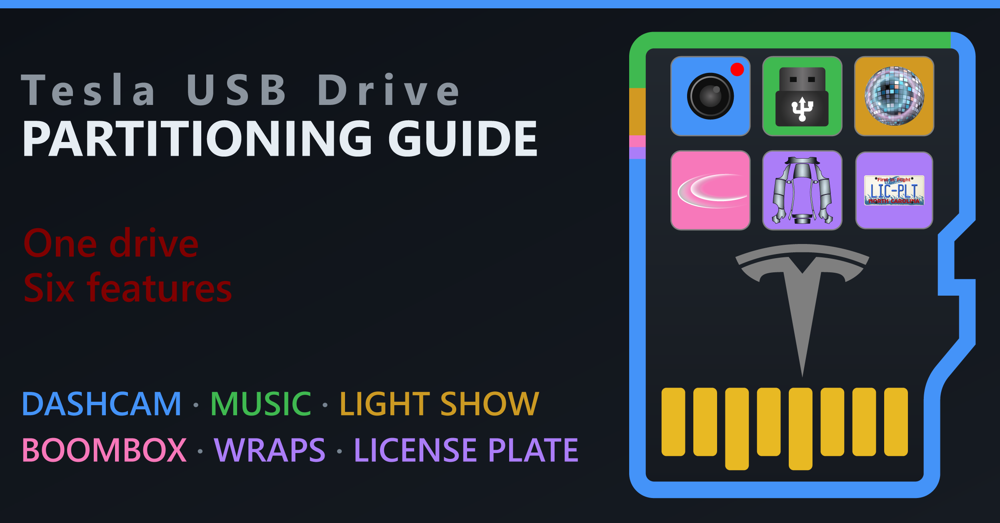
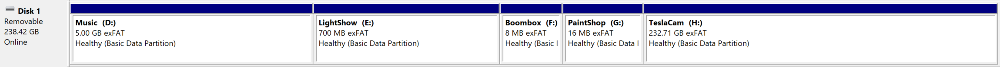
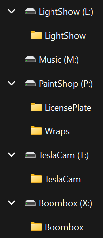
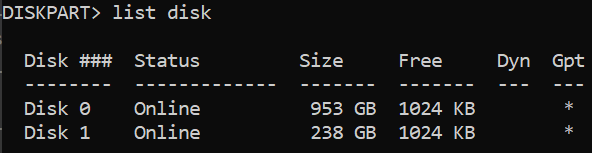
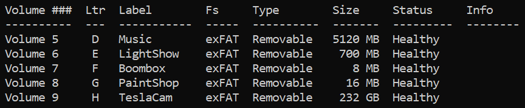

<p align="center">
  
</p>

## Summary

A complete step-by-step guide explaining the [purpose of partitioning](#definitions) a USB drive for use in Tesla vehicles, which [features can share](#feature-compatibility) the same partition, how to [plan your partitions](#partitioning-plan), [how to partition](#how-to-partition) your drive based on that plan, and the [file requirements](#file-requirements) for each of the features. The partition instructions include two methods - [graphical](#windows-graphical) and [command line](#windows-command-line) - to partition a single physical USB drive (SSD or microSD card) to support all six Tesla USB-based features:

- [Dashcam](https://www.notateslaapp.com/news/4238/tesla-dashcam-sentry-mode-how-to-get-24-hours-of-rolling-footage)/Sentry Mode - "[TeslaCam](https://www.tesla.com/ownersmanual/modely/en_us/GUID-F311BBCA-2532-4D04-B88C-DBA784ADEE21.html#:~:text=The%20TeslaCam%20folder%20contains%20these%20sub-folders)" for the rest of this guide.
- [Music](https://www.notateslaapp.com/news/2145/how-to-set-up-tesla-usb-drive-for-music-supports-lossless-audio)
- [Light Show](https://xlightshows.io/light-shows/) - 'LightShow' for the rest of this guide.
- [Boombox](https://www.notateslaapp.com/tesla-custom-lock-sounds/)
- [Wraps](https://www.notateslaapp.com/news/2414/how-to-create-your-own-custom-cybertruck-wrap-for-visualizations)
- [License Plate](https://www.notateslaapp.com/news/4561/how-to-create-custom-tesla-license-plate-visualizations) - 'LicensePlate' for the rest of this guide.

A companion [Tesla USB Drive Partitioning Planner](https://gizmogoody.github.io/tesla-usb-drive-partitioning-guide/partitioning-planner.html) is also available: it generates a customized partition plan and matching step-by-step instructions based on your own drive size and feature choices, instead of the example plan used throughout this guide.

This guide is also an attempt to consolidate all accurate information (directly and/or via linked references) regarding the requirements, limitations, and compatibility of the drives/partitions, folders, and files for all Tesla USB-based features. Please let me know if you find any errors.

***Last verified: September 2026***

## Definitions

### What is partitioning?

<details>
<summary>Answer</summary>

Partitioning is a method that divides one physical drive into multiple independent, separately-formatted sections called partitions, each of which displays on your computer (and your car) as their own separate drives — as if you plugged in several smaller physical USB drives instead of one big one. The physical drive itself does not change size; you are just specifying boundaries on it so that different chunks of it can be managed, formatted, and read independently of each other. This is different from a folder, which just organizes files *within* a single partition.

</details>

### Why must a USB drive be partitioned for use in a Tesla?

<details>
<summary>Answer</summary>

Some features scan a USB drive for a specific base-level folder. If multiple special folders live on the **same** drive/partition, Tesla's software gets confused and one or more features stop being recognized.  Giving each conflicting feature its own partition avoids these conflicts entirely, since each partition is invisible to the others — the car sees separate "drives," each with exactly one job. The only other way to do this would be to have multiple physical drives connected via a USB hub to the one USB data port (glovebox) on newer Tesla vehicles - this would be ridiculous. *I have no idea why such a technologically advanced company did not sort out a better folder management solution long ago, but here we are.* 🤷🏼‍♂️

</details>

## Feature Compatibility

### Which USB-based feature pairings are compatible?

This table depicts the six features, their compatibility with each other (folders on the same drive/partition), and links to the best known source for that information. Each icon's shape indicates the documentation source while the color indicates compatibility of that cell's two features (column and row pairing).

| | [TeslaCam](https://www.tesla.com/ownersmanual/modely/en_us/GUID-F311BBCA-2532-4D04-B88C-DBA784ADEE21.html#:~:text=The%20TeslaCam%20folder%20contains%20these%20sub-folders) | [Music](https://www.tesla.com/ownersmanual/modely/en_us/GUID-7A85FB6B-9DF6-4C55-A2F9-793207E48E9D.html#:~:text=USB%20Flash%20Drives) | [LightShow](https://github.com/teslamotors/light-show#usb-flash-drive-requirements) | [Boombox](https://www.tesla.com/ownersmanual/modely/en_us/GUID-79A49D40-A028-435B-A7F6-8E48846AB9E9.html#:~:text=Prepare%20a%20USB%20drive%20for%20Boombox) | [Wraps](https://github.com/teslamotors/custom-wraps#how-to-use-custom-wraps) | [LicensePlate](https://github.com/teslamotors/custom-wraps/pull/14) |
|:---:|:---:|:---:|:---:|:---:|:---:|:---:|
| **[TeslaCam](https://www.tesla.com/ownersmanual/modely/en_us/GUID-F311BBCA-2532-4D04-B88C-DBA784ADEE21.html#:~:text=The%20TeslaCam%20folder%20contains%20these%20sub-folders)** | <span title="TeslaCam — same feature, not applicable">&mdash;</span> | <a href="https://www.tesla.com/ownersmanual/modely/en_us/GUID-3BCC07CE-5EA2-4F40-99D1-27690898FF3C.html#:~:text=You%20can%20use%20one%20USB%20drive,separate%20partitions%20or%20folders"></a> | <a href="https://github.com/teslamotors/light-show#usb-flash-drive-requirements"></a> | <a href="https://www.tesla.com/ownersmanual/modely/en_us/GUID-79A49D40-A028-435B-A7F6-8E48846AB9E9.html#:~:text=The%20USB%20drive%20can%20only%20contain%20one%20folder"></a> | <a href="https://github.com/teslamotors/custom-wraps/issues/18"></a> | <a href="https://github.com/teslamotors/custom-wraps/issues/18"></a> |
| **[Music](https://www.tesla.com/ownersmanual/modely/en_us/GUID-7A85FB6B-9DF6-4C55-A2F9-793207E48E9D.html#:~:text=USB%20Flash%20Drives)** | <a href="https://www.tesla.com/ownersmanual/modely/en_us/GUID-3BCC07CE-5EA2-4F40-99D1-27690898FF3C.html#:~:text=You%20can%20use%20one%20USB%20drive,separate%20partitions%20or%20folders"></a> | <span title="Music — same feature, not applicable">&mdash;</span> | <a href="https://github.com/teslamotors/light-show/issues/111#issuecomment-2458422413"></a> | <a href="#user-content-disputed-music-boombox"></a> | <span title="Music x Wraps — Unknown (undocumented): No source addresses this pairing either way.">&#129000;</span> | <span title="Music x LicensePlate — Unknown (undocumented): No source addresses this pairing either way.">&#129000;</span> |
| **[LightShow](https://github.com/teslamotors/light-show#usb-flash-drive-requirements)** | <a href="https://github.com/teslamotors/light-show#usb-flash-drive-requirements"></a> | <a href="https://github.com/teslamotors/light-show/issues/111#issuecomment-2458422413"></a> | <span title="LightShow — same feature, not applicable">&mdash;</span> | <a href="#user-content-disputed-lightshow-boombox"></a> | <a href="https://github.com/mphacker/TeslaUSB#overview"></a> | <a href="https://github.com/mphacker/TeslaUSB#license-plate-management"></a> |
| **[Boombox](https://www.tesla.com/ownersmanual/modely/en_us/GUID-79A49D40-A028-435B-A7F6-8E48846AB9E9.html#:~:text=Prepare%20a%20USB%20drive%20for%20Boombox)** | <a href="https://www.tesla.com/ownersmanual/modely/en_us/GUID-79A49D40-A028-435B-A7F6-8E48846AB9E9.html#:~:text=The%20USB%20drive%20can%20only%20contain%20one%20folder"></a> | <a href="#user-content-disputed-music-boombox"></a> | <a href="#user-content-disputed-lightshow-boombox"></a> | <span title="Boombox — same feature, not applicable">&mdash;</span> | <a href="https://www.tesla.com/ownersmanual/modely/en_us/GUID-79A49D40-A028-435B-A7F6-8E48846AB9E9.html#:~:text=The%20USB%20drive%20can%20only%20contain%20one%20folder"></a> | <a href="https://www.tesla.com/ownersmanual/modely/en_us/GUID-79A49D40-A028-435B-A7F6-8E48846AB9E9.html#:~:text=The%20USB%20drive%20can%20only%20contain%20one%20folder"></a> |
| **[Wraps](https://github.com/teslamotors/custom-wraps#how-to-use-custom-wraps)** | <a href="https://github.com/teslamotors/custom-wraps/issues/18"></a> | <span title="Wraps x Music — Unknown (undocumented): No source addresses this pairing either way.">&#129000;</span> | <a href="https://github.com/mphacker/TeslaUSB#overview"></a> | <a href="https://www.tesla.com/ownersmanual/modely/en_us/GUID-79A49D40-A028-435B-A7F6-8E48846AB9E9.html#:~:text=The%20USB%20drive%20can%20only%20contain%20one%20folder"></a> | <span title="Wraps — same feature, not applicable">&mdash;</span> | <a href="https://www.dburkland.com/how-to-setup-tesla-boombox-with-custom-sounds/#:~:text=sudo%20mkdir%20/Volumes/PAINTSHOP/LicensePlate"></a> |
| **[LicensePlate](https://github.com/teslamotors/custom-wraps/pull/14)** | <a href="https://github.com/teslamotors/custom-wraps/issues/18"></a> | <span title="LicensePlate x Music — Unknown (undocumented): No source addresses this pairing either way.">&#129000;</span> | <a href="https://github.com/mphacker/TeslaUSB#license-plate-management"></a> | <a href="https://www.tesla.com/ownersmanual/modely/en_us/GUID-79A49D40-A028-435B-A7F6-8E48846AB9E9.html#:~:text=The%20USB%20drive%20can%20only%20contain%20one%20folder"></a> | <a href="https://www.dburkland.com/how-to-setup-tesla-boombox-with-custom-sounds/#:~:text=sudo%20mkdir%20/Volumes/PAINTSHOP/LicensePlate"></a> | <span title="LicensePlate — same feature, not applicable">&mdash;</span> |

### Legend

<details>
<summary><strong>Shape = Source</strong></summary>

- <picture></picture> **Tesla documented** - Tesla's documentation addresses this pairing.
- <picture></picture>  **Community reported**  - Unofficially documented results for this pairing.
- <picture></picture>  **Disputed**  - Tesla's documentation and community reports disagree. The color follows Tesla's documented position. See below for more details on each disputed pairing.
  <details><summary>Disputed Pairings (click to expand)</summary><ul><li id="user-content-disputed-music-boombox"><strong>Music x Boombox</strong> — Tesla’s <a href="https://www.tesla.com/ownersmanual/modely/en_us/GUID-79A49D40-A028-435B-A7F6-8E48846AB9E9.html#:~:text=The%20USB%20drive%20can%20only%20contain%20one%20folder">Boombox instructions</a> say the drive "can only contain one folder," yet <a href="https://github.com/teslamotors/light-show/issues/112#issuecomment-2486361697">deepcoder’s three-partition layout</a> runs <code>Boombox</code> and <code>Music</code> together on one volume with all five functions working; the rule arguably does not apply because Music needs no folder of its own.</li><li id="user-content-disputed-lightshow-boombox"><strong>LightShow x Boombox</strong> — Tesla’s <a href="https://www.tesla.com/ownersmanual/modely/en_us/GUID-79A49D40-A028-435B-A7F6-8E48846AB9E9.html#:~:text=The%20USB%20drive%20can%20only%20contain%20one%20folder">Boombox instructions</a> say the same, yet <a href="https://github.com/teslamotors/light-show/issues/111">DreadfullyDespized’s layout</a> puts <code>Boombox</code> and <code>LightShow</code> on one volume and reports it working on a 2023 Model 3 RWD.</li></ul></details>
- &#129000;  **Undocumented**  - This pairing is not documented/tested.
- &mdash;  **Not applicable**  - A feature paired with itself.

</details>

<details>
<summary><strong>Color = Compatibility</strong></summary>

- 🟩 **Compatible** - Both features work from the same drive/partition.
- 🟥 **Incompatible** - These features would be in conflict if located on the same drive/partition.
- 🟨 **Unknown/Uncertain** - This pairing is not documented/tested.

</details>

## Partitioning Plan

With a comprehensive view of the conflicts, we can decide how to group the features into partitions and decide how much disk space to allocate each partition based on a few considerations. The following list describes why I decided to use five partitions, but you could probably reduce down to a minimum of three.

<details><summary><strong>Constraints</strong></summary><ul><li><strong>Compatibility</strong> — Feature pairing compatibility according to the table above.</li><li><strong>Root-level folder</strong> — All features except <code>Music</code> explicitly require a dedicated folder at the root of the partition.</li></ul></details>

<details><summary><strong>File Type Categories</strong></summary><ul><li><strong>TeslaCam</strong> — Dashcam and Sentry Mode video. <details><summary>Detail</summary>Isolating this feature is a best practice, not strictly a requirement. Per Tesla's <a href="https://www.tesla.com/ownersmanual/modely/en_us/GUID-F311BBCA-2532-4D04-B88C-DBA784ADEE21.html#:~:text=The%20TeslaCam%20folder%20contains%20these%20sub-folders">USB Drive Requirements for Recording Videos</a>, the drive itself needs a minimum 64 GB capacity, a sustained write speed of at least 4 MB/s, and USB 2.0 compatibility. Format as exFAT, MS-DOS FAT (Mac), ext3, or ext4 — NTFS is not supported.</details></li><li><strong>Music</strong> — <code>.mp3</code> song files and related metadata. <details><summary>Detail</summary>Isolated for easier management of music library, not strictly a requirement, and does not require its own folder. Tesla's <a href="https://www.tesla.com/ownersmanual/modely/en_us/GUID-7A85FB6B-9DF6-4C55-A2F9-793207E48E9D.html#:~:text=USB%20Flash%20Drives">USB Flash Drives page</a> confirms exFAT support; NTFS is not supported. Note that tesla.com blocks automated retrieval, so the supported-format list in the table below is aggregated from community sources rather than quoted directly from Tesla.</details></li><li><strong>LightShow</strong> — <code>.fseq</code> custom light show files and their accompanying <code>.mp3</code>/<code>.wav</code> soundtracks.<details><summary>Detail</summary>A <code>LightShow</code> root folder of matched files. Tesla documents that this cannot share a volume with a <code>TeslaCam</code> folder, and it is disputed against Boombox. It is community-reported compatible with Music, Wraps, and LicensePlate, which makes it the one feature remaining that could be consolidated. Format as exFAT, FAT32 (Windows), MS-DOS FAT (Mac), ext3, or ext4 — NTFS is not supported.</details></li><li><strong>Boombox</strong> — Pedestrian Warning Speaker (PWS) <code>.mp3</code>/<code>.wav</code> audio files.<details><summary>Detail</summary>Honk (in park only) and lock chime clips. The honk files must be in a <code>Boombox</code> folder of up to 5 short (under 5 sec) clips. The lock chime must be named <code>LockChime.wav</code>, placed at the partition root, and also short (under 5 sec). Other lock chime clips can exist on the root alongside it, but only the file named LockChime.wav will be recognized for the lock chime feature. Tesla documents that a Boombox drive can only contain one folder and cannot be shared with Dashcam, so this partition stays on its own no matter how little space it needs. Keeping <code>LockChime.wav</code> at the root rather than inside <code>Boombox</code> puts every PWS-related file on this one partition. Boombox sounds play only while the car is in Park (February 2022 NHTSA ruling) and require an external pedestrian warning speaker: Model 3, Y, S, and X built September 2019 or later, or any Cybertruck.</details></li><li><strong>PaintShop</strong> — Toybox Paint Shop <code>.png</code> image files.<details><summary>Detail</summary>Two sibling root folders: <code>Wraps</code> for vehicle skins and <code>LicensePlate</code> for plate backgrounds. The two are compatible with each other and both are community-reported compatible with LightShow. Tesla's <a href="https://github.com/teslamotors/custom-wraps#how-to-use-custom-wraps">Custom Wraps repo</a> also requires that the drive contain no map or firmware update files. The License Plate requirements come from a <a href="https://github.com/teslamotors/custom-wraps/pull/14">pending pull request</a> to Tesla's Custom Wraps repo that has not been merged, plus <a href="https://github.com/mphacker/TeslaUSB">mphacker/TeslaUSB</a>.</details></li></ul></details>

<details><summary><strong>File Properties</strong></summary><ul><li><strong>Typical file size</strong><details><summary>Detail</summary>Dashcam clips and <code>.fseq</code> shows are large and written straight through; album art, plate PNGs and short <code>.wav</code> clips are small and numerous. This is the property the allocation unit should be matched to, and two features whose typical file sizes differ sharply want different allocation units — the main reason to split features the compatibility table would otherwise let you combine.</details></li><li><strong>Allocation unit size</strong> — The smallest block of space the file system will hand to a single file, fixed when you format and changeable only by reformatting. <details><summary>Detail</summary>A 5 KB file on a partition formatted with 128 KB allocation units still occupies a full 128 KB — 123 KB of it wasted; on 4 KB units that same file occupies 8 KB. Large units reduce bookkeeping overhead and suit big files, small units reduce waste when a partition holds many small files.</details></li><li><strong>Total required capacity</strong> — Disk space required by all files used by the feature. <details><summary>Detail</summary>Boombox tops out at 5 short clips and PaintShop at 20 small PNGs, so both are happy with a relatively small amount of disk space. Music depends entirely on the size of your library. TeslaCam will use everything you give it, which is why it is sized last.</details></li><li><strong>Write pattern</strong> — How often, and how unpredictably, the car writes to the partition. <details><summary>Detail</summary>Dashcam and Sentry Mode write continuously and the car can lose power or drop the drive mid-write. exFAT is not journaled, so an unclean dismount can corrupt the whole volume — and everything sharing it. Every other feature is written once by you and only read by the car, so keeping the constantly-written partition separate confines that risk and stops TeslaCam’s appetite for free space from starving anything else. Note this does <em>not</em> reduce flash wear: wear levelling operates across the entire device, not per partition.</details></li><li><strong>File System</strong> — Tesla now supports exFAT for all files, so this is no longer a factor, but I wanted to keep it here for completeness.</li></ul></details>

<br>

Using this approach, here is how I divided the ~238.42 usable GB on my 256 GB drive. Your physical drive's size, car's supported features, music library, etc. may be different so adjust accordingly.

> [!TIP]
> **Open the [Partitioning Planner](https://gizmogoody.github.io/tesla-usb-drive-partitioning-guide/partitioning-planner.html)** to generate your own numbers instead of mine: enter your drive's usable GB, check off the features you want, and it produces a sized version of the table below plus matching copy-ready instructions for both methods in [How to partition](#how-to-partition).

| Partition | Size (MB) <span title="Multiply GB by 1024 to get MB. For example 5 GB x 1024 = 5,120 MB. Disk Management and diskpart both expect sizes in MB.">&#9432;</span> | Unit (KB) <span title="Allocation unit size: the smallest block of space the file system will hand to a file. A larger unit wastes less overhead on big files, a smaller one wastes less space on small files.">&#9432;</span> | Folder(s) | <a id="file-requirements"></a>Files |
|---|---|---|---|---|
| **Music** | 5,120 | 32 | None required | <details><summary>&#128196;</summary><ul><li><strong>File types:</strong> MP3, FLAC, M4A, OGG, WAV. Apple Lossless and DRM-protected M4P will not play.</li><li><strong>Maximum files:</strong> None documented</li><li><strong>Maximum file size:</strong> None documented</li><li><strong>Naming:</strong> None documented; any folder structure works</li></ul>The format list is aggregated from community sources rather than quoted from Tesla.<br>Source: <a href="https://www.tesla.com/ownersmanual/modely/en_us/GUID-7A85FB6B-9DF6-4C55-A2F9-793207E48E9D.html#:~:text=USB%20Flash%20Drives">Tesla's USB Flash Drives page</a></details> |
| **LightShow** | 700 | 128 | `LightShow` | <details><summary>&#128196;</summary><ul><li><strong>File types:</strong> A <code>.fseq</code> show file plus a matching <code>.mp3</code> or <code>.wav</code> (wav recommended)</li><li><strong>Maximum files:</strong> Multiple shows supported from vehicle software 2023.44.25 onward</li><li><strong>Naming:</strong> Each <code>.fseq</code> must match its audio filename (<code>show1.fseq</code> with <code>show1.wav</code>); the folder must be named <code>LightShow</code> (case sensitive)</li><li><strong>Duration:</strong> 4 hours maximum per show</li></ul>The drive must not contain any map or firmware update files.<br>Source: <a href="https://github.com/teslamotors/light-show#usb-flash-drive-requirements">Light Show USB flash drive requirements</a></details> |
| **Boombox** | 8 | 16 | `Boombox` | <details><summary>&#128196;</summary><ul><li><strong>File types:</strong> MP3 or WAV</li><li><strong>Maximum files:</strong> 5 in the <code>Boombox</code> folder; if more are present the car loads the first 5 alphabetically</li><li><strong>Maximum file size:</strong> 1 MB per file</li><li><strong>Naming:</strong> The lock chime must be named exactly <code>LockChime.wav</code> and sit at the partition root, not inside <code>Boombox</code>. Other names are limited to 64 characters using letters, numbers, spaces, underscores, dashes, and dots.</li><li><strong>Duration:</strong> 5 seconds or shorter recommended</li></ul>The per-file limits are enumerated by <a href="https://github.com/mphacker/TeslaUSB">mphacker/TeslaUSB</a> rather than stated directly by Tesla.<br>Source: <a href="https://www.tesla.com/ownersmanual/modely/en_us/GUID-79A49D40-A028-435B-A7F6-8E48846AB9E9.html#:~:text=Prepare%20a%20USB%20drive%20for%20Boombox">Tesla's Boombox instructions</a></details> |
| **PaintShop** | 16 | 4 | `Wraps` `LicensePlate` | <details><summary>&#128196;</summary><strong>Wraps</strong><ul><li><strong>File types:</strong> PNG</li><li><strong>Maximum files:</strong> 10 at a time</li><li><strong>Maximum file size:</strong> 1 MB per file</li><li><strong>Dimensions:</strong> Between 512 and 1024 px</li></ul>The drive must not contain any map or firmware update files.<br>Source: <a href="https://github.com/teslamotors/custom-wraps#how-to-use-custom-wraps">Tesla's Custom Wraps repo</a><hr><strong>LicensePlate</strong><ul><li><strong>File types:</strong> PNG</li><li><strong>Maximum files:</strong> 10 at a time</li><li><strong>Maximum file size:</strong> 0.5 MB per file</li><li><strong>Dimensions:</strong> 420x200 px (North America) or 420x100 px (Europe)</li><li><strong>Naming:</strong> Alphanumeric, 32 characters or fewer</li></ul>Source: <a href="https://github.com/teslamotors/custom-wraps/pull/14">a pending pull request</a> to Tesla's Custom Wraps repo</details> |
| **TeslaCam** | ~238,298 | 128 | `TeslaCam` | <details><summary>&#128196;</summary>You do not add files yourself. The car creates and manages <code>RecentClips</code> (a rolling buffer of up to 60 minutes), <code>SavedClips</code>, and <code>SentryClips</code> inside the folder.<ul><li><strong>Drive:</strong> 64 GB minimum, sustained write of at least 4 MB/s</li></ul>Source: <a href="https://www.tesla.com/ownersmanual/modely/en_us/GUID-F311BBCA-2532-4D04-B88C-DBA784ADEE21.html#:~:text=The%20TeslaCam%20folder%20contains%20these%20sub-folders">Tesla's TeslaCam documentation</a></details> |

## How to partition

Phew! Now that we have a physical USB drive and a plan, we can partition and format it. I successfully performed the command line method on two [SanDisk 256GB High Endurance microSD Cards](https://www.amazon.com/dp/B07P4HBRMV) in [SanDisk MobileMate microSD Card Readers](https://www.amazon.com/dp/B07G5JV2B5) on Windows 11 and used them in a 2026 Model Y Premium and 2018 Model 3 <span title="I chose to use the same partition plan for my Model 3 simply for consistency even though Boombox is unavailable due to lack of a PWS.">&#9432;</span>.

<a id="two-methods"></a>Two Windows methods are provided. See [DBurkland's guide](https://www.dburkland.com/how-to-setup-tesla-boombox-with-custom-sounds/) for Mac. The sizes below are the ones from my plan above — if you used the [Partition Planner](https://gizmogoody.github.io/tesla-usb-drive-partitioning-guide/partitioning-planner.html) to generate your own, substitute its output for the sizes and commands shown here.

<details>
<summary><strong><a id="windows-graphical"></a>Graphical — easier, point-and-click</strong></summary>

1. Connect the USB drive to your Windows PC.
2. Open Disk Management: press the <kbd>⊞</kbd> Windows key, type `diskmgmt`, and select **Create and format hard disk partitions**.

> 🛑 **The following step deletes every partition and all data on the drive.** Back up anything you want to keep first, and make sure you have selected your intended USB drive — not an internal disk or any other disk other than the intended Tesla USB drive.

3. Identify your drive: Locate your USB drive in the list (the drive matching your drive's usable capacity, e.g., ~238.42 GB). Right-click its existing partition and select **Delete Volume**. If there are multiple partitions, delete them all until the entire drive indicates **Unallocated**.
4. Create and format the **Music** partition:
   - Create the partition: right-click the **Unallocated** space → **New Simple Volume**, then step through the wizard with these parameters:
     - Size: **5120 MB**
     - Drive letter: **Accept the default or pick any available letter**
     - Format: **Do not format this volume**

   > [!NOTE]
   > Windows detects the new partition right away and may show an **Insert disk** message, or prompt you to format it. Close both windows — the partition is formatted in the next step.

   - Format the partition: right-click the new **RAW** partition → **Format…**, then set these parameters:
     - Volume label: **Music**
     - File system: **exFAT**
     - Allocation unit size: **32K**
     - Perform a quick format: **Selected**
5. Create and format the **LightShow** partition:
   - Create the partition with these parameters:
     - Size: **700 MB**
     - Drive letter: **Accept the default or pick any available letter**
     - Format: **Do not format this volume**
   - Format the partition with these parameters:
     - Volume label: **LightShow**
     - File system: **exFAT**
     - Allocation unit size: **128K**
     - Perform a quick format: **Selected**
6. Create and format the **Boombox** partition:
   - Create the partition with these parameters:
     - Size: **8 MB**
     - Drive letter: **Accept the default or pick any available letter**
     - Format: **Do not format this volume**
   - Format the partition with these parameters:
     - Volume label: **Boombox**
     - File system: **exFAT**
     - Allocation unit size: **16K**
     - Perform a quick format: **Selected**
7. Create and format the **PaintShop** partition:
   - Create the partition with these parameters:
     - Size: **16 MB**
     - Drive letter: **Accept the default or pick any available letter**
     - Format: **Do not format this volume**
   - Format the partition with these parameters:
     - Volume label: **PaintShop**
     - File system: **exFAT**
     - Allocation unit size: **4096**
     - Perform a quick format: **Selected**
8. Create and format the **TeslaCam** partition: TeslaCam is created last because it claims whatever space is not used by the other partitions.
   - Create the partition with these parameters:
     - Size: **Accept the default (remaining) size**
     - Drive letter: **Accept the default or pick any available letter**
     - Format: **Do not format this volume**
   - Format the partition with these parameters:
     - Volume label: **TeslaCam**
     - File system: **exFAT**
     - Allocation unit size: **128K**
     - Perform a quick format: **Selected**
9. Verify all intended partitions are created. This screenshot depicts the default partitioning plan.
    - Music: **5.00 GB**
    - LightShow: **700 MB**
    - Boombox: **8 MB**
    - PaintShop: **16 MB**
    - TeslaCam: **~232.71 GB**

    [](docs/screenshots/disk-management-all-partitions-created.png)

10. Open File Explorer and create the required folders according to the partitioning plan:
    - On **Music** → no folder needed; drop audio files in directly
    - On **LightShow** → new folder named `LightShow`
    - On **Boombox** → new folder named `Boombox`
    - On **PaintShop** → two new folders named `Wraps` and `LicensePlate`
    - On **TeslaCam** → new folder named `TeslaCam`
11. Verify all required folders are created. This screenshot depicts the default partitioning plan, with drive letters optionally reassigned (right-click the partition in Disk Management → **Change Drive Letter and Paths…** → **Change** → pick a letter → **OK**).

    <a href="docs/screenshots/file-explorer-required-folders.png"></a>

12. Add content as detailed in the [Files column](#file-requirements) of the Partitioning Plan table above.
    - On **Boombox** → place `LockChime.wav` at the partition root, not inside a folder
13. Safely eject the drive, insert it into your Tesla's USB data port (e.g. glovebox or center console), and confirm all features work as expected.

</details>

<details>
<summary><strong><a id="windows-command-line"></a>Command Line — faster, scriptable, repeatable across multiple drives</strong></summary>

> ⚠️ **Read this entire section before running anything.** The `clean` command below is irreversible and disk-wide.

1. Connect the USB drive to your Windows PC.
2. Open an elevated Command Prompt: search `cmd` → right-click → **Run as administrator** → **Yes** at the User Account Control prompt.
3. Identify your drive:

   ```
   diskpart
   list disk
   ```

   Look at the **Size** column. Your USB drive will be indicated by your drive's usable capacity (e.g., ~238.42 GB). Note its **Disk number**.

   [](docs/screenshots/diskpart-list-disk.png)

   In this example, **Disk 1** is the USB drive.

> 🛑 **CRITICAL — VERIFY THE DISK NUMBER BEFORE CONTINUING.** The next command, `clean`, **permanently erases everything** on whatever disk number you select. There is no undo, no confirmation prompt, no recycle bin.
>
> Before typing `select disk`, stop and verify:
> - The size shown matches your USB drive specifically — **not** a much larger number that would indicate your PC's internal system drive
> - You are looking at the drive currently plugged in, not relying on memory from a previous session
>
> **If you are ever unsure:** close diskpart `exit`, safely eject the USB drive, reopen diskpart `diskpart`, run `list disk` again, and see which disk disappeared. That is your drive. Restart at Step 1.

4. Clear the drive and convert it to GPT<span title="GPT is used instead of MBR because MBR caps you at 4 primary partitions without extended/logical partition workarounds - GPT handles partitions natively regardless of count.">&#9432;</span>:

   ```
   select disk # <-- REPLACE "#" WITH YOUR VERIFIED DISK NUMBER
   clean
   convert gpt
   ```

5. Create and format each partition:

   ```
   create partition primary size=5120
   format fs=exfat quick unit=32K label="Music"
   assign

   create partition primary size=700
   format fs=exfat quick unit=128K label="LightShow"
   assign

   create partition primary size=8
   format fs=exfat quick unit=16K label="Boombox"
   assign

   create partition primary size=16
   format fs=exfat quick unit=4K label="PaintShop"
   assign

   create partition primary
   format fs=exfat quick unit=128K label="TeslaCam"
   assign
   ```

   The final `create partition primary` (no `size=`) automatically claims all remaining drive space for TeslaCam.

6. Verify all intended partitions are created. This screenshot depicts the default partitioning plan.

   ```
   detail disk
   exit
   ```

   - Music: **5120 MB**
   - LightShow: **700 MB**
   - Boombox: **8 MB**
   - PaintShop: **16 MB**
   - TeslaCam: **~232 GB**

   [](docs/screenshots/diskpart-detail-disk.png)

7. Create the required folders:

   ```
   for /f %L in ('powershell -NoProfile -Command "(Get-Volume -FileSystemLabel 'LightShow').DriveLetter"') do mkdir %L:\LightShow
   for /f %L in ('powershell -NoProfile -Command "(Get-Volume -FileSystemLabel 'Boombox').DriveLetter"') do mkdir %L:\Boombox
   for /f %L in ('powershell -NoProfile -Command "(Get-Volume -FileSystemLabel 'PaintShop').DriveLetter"') do (
       mkdir %L:\Wraps
       mkdir %L:\LicensePlate
   )
   for /f %L in ('powershell -NoProfile -Command "(Get-Volume -FileSystemLabel 'TeslaCam').DriveLetter"') do mkdir %L:\TeslaCam
   ```

   No folder is created on Music — files can go straight into the root.

8. Close the Command Prompt window.
9. In File Explorer, verify all required folders are created. This screenshot depicts the default partitioning plan, with drive letters optionally reassigned<span title="In Disk Management (press the Windows key, type diskmgmt, and select Create and format hard disk partitions), right-click a partition, choose Change Drive Letter and Paths..., click Change, pick a letter, and click OK.">&#9432;</span>.

    <a href="docs/screenshots/file-explorer-required-folders.png"></a>

10. Add content as detailed in the [Files column](#file-requirements) of the Partitioning Plan table above.
    - On **Boombox** → place `LockChime.wav` at the partition root, not inside a folder
11. Safely eject the drive, insert it into your Tesla's USB data port (e.g. glovebox or center console), and confirm all features work as expected.

</details>